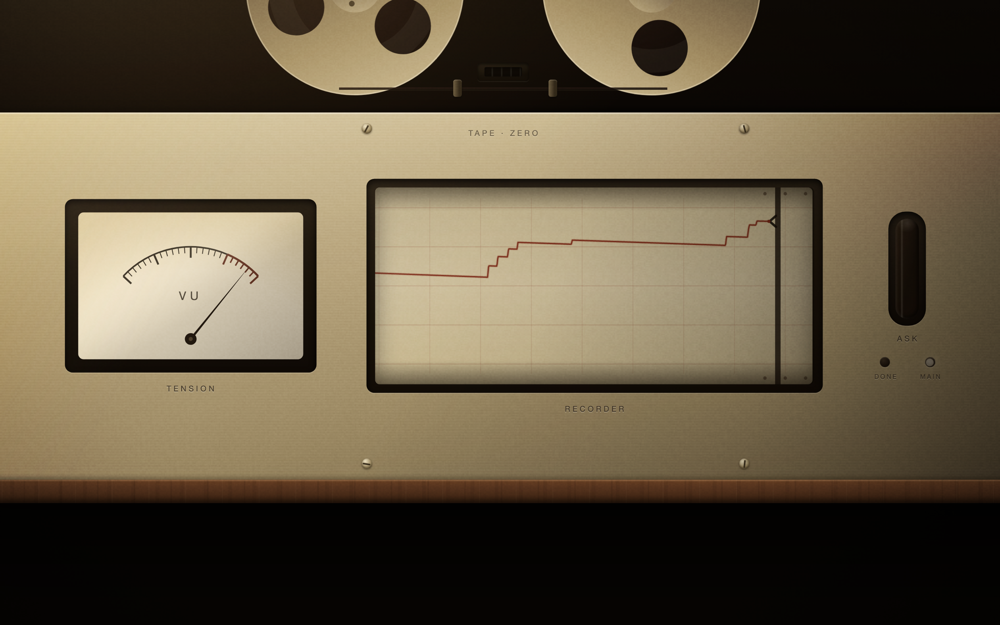
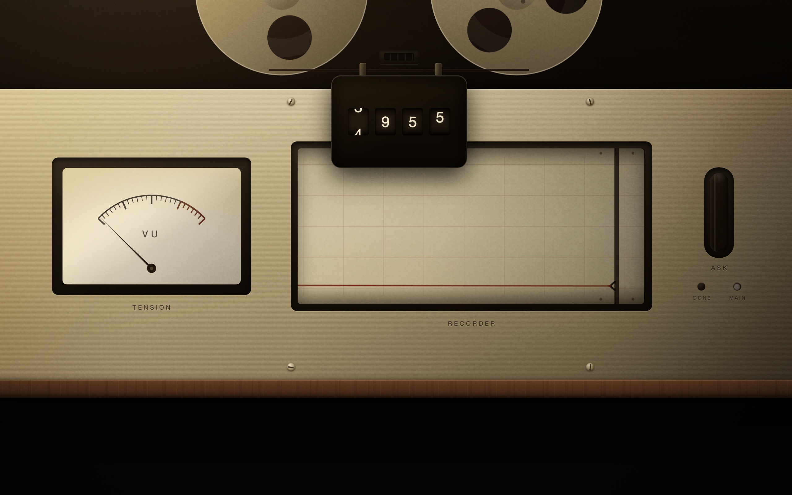
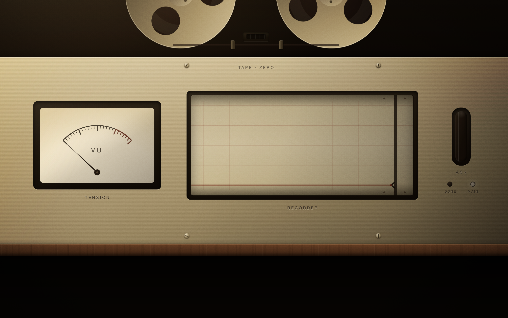

# Foley

**A lo-fi tape instrument for your coding agents.**
<sub>First deck: TAPE·ZERO · [中文说明](README.zh.md)</sub>



Your agent works for minutes at a time. You get two options: stare at scrolling logs, or walk away and worry.

Foley is a third option — a small tape machine that plays your session as it happens. A needle for tension. A strip-chart recorder drawing the session's cardiogram in ox-blood ink. An amber lamp that breathes only when the agent is waiting for *you*.

Glance at it from across the room and you know which kind of day it is: smooth sailing, gathering weather, or *it needs me*.

## Quickstart

```bash
npx foley
```

Foley finds your most recent Claude Code session and starts playing it. No config. No account. No network. Nothing leaves your machine.

Replay any past session:

```bash
npx foley replay <session>
```

## What you're looking at



- **TENSION (VU)** — the needle is driven by a real spring-damper model inside the engine. It overshoots, settles, and trembles when the session is unstable. The renderer adds no easing; every quiver you see is data.
- **RECORDER** — the session draws its own pressure trace. The paper *is* the timeline. Gaps in a resumed session leave visible splice marks — the tape is honest about its cuts.
- **ASK** — the amber lamp breathes only when the agent is waiting for your permission. It never cries wolf, and it never gets tired.
- **The green gem** — says one word: *settled*. Steady glow: the session is done. A single blink: one thing got resolved.
- **REELS** — speed is activity, wobble is uncertainty. When the agent steps on the same rake three times, the reel sticks and beats in place like a needle caught in a groove.
- **COUNTER** — a dark slit on the panel. Numbers live only under the loupe (hover). This face has no digits; that's a rule, not an oversight.



## Sound (early)

Three sounds today: a **pluck** for work, a **chord** for resolution, a **needle-skip** for a jam. Success sits high, failure sits low; you can hear the register of a session without looking.

In progress: a continuous lo-fi bed where *the tape itself ages* as tension rises — hiss thickens, wow deepens, highs dull — and clears again when the trouble passes. Rain stopping isn't a chime; it's the room going quiet. See the [sensory design whitepaper](docs/canon/TAPE0_WHITEPAPER_SENSES_v1.md).

## House rules

A few laws this machine lives by:

1. **No numbers on the face.** Instruments qualify; they don't quantify.
2. **Never fabricate direction.** Renderers may exaggerate amplitude, never invent movement. The engine computes evidence only.
3. **Wear is signal, not decoration.** Aging lives on the media (tape, paper) — the machine stays factory-new.
4. **Abandoned jams get no fanfare.** A jam broken by a real fix earns the chord; a jam that merely expires goes quietly.
5. **The machine may fast-forward; its voice to you never does.** At 8× replay the reels race, but the amber lamp still breathes at human speed.

## Privacy

Foley reads your local session logs and **distills** them into event skeletons — verbs, timings, sizes, hashed targets. Tool inputs, outputs, and conversation text are never stored. Zero telemetry, fully offline. A `--redact` mode produces a minimized shareable form (adversarially red-teamed; still, don't share tapes you haven't reviewed).

## Why "Foley"

In the 1930s, Jack Foley watched the picture and performed its sounds by hand — footsteps, rustles, weather — live, in sync, with physical objects. This machine does the same job for invisible labor: it watches your agent's session and performs its sounds in tape.

## Status

- ✅ Engine sealed (`v0.1.0`) — deterministic, calibrated on real session tapes, 38 golden tests
- ✅ The deck — needle, recorder, lamps, reels, counter (replay)
- 🔊 Sound layer — three sounds live; lo-fi bed in progress
- 🚧 Live mode wiring · trailer export · multi-track (**AUTOREVERSE**) · hosted replays

## License

MIT. The tape is yours.
